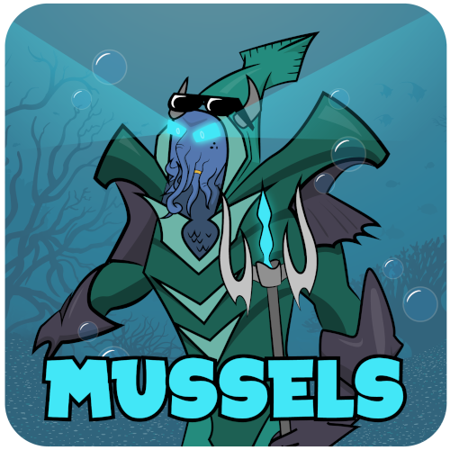

# 

A tool to download, build, and assemble application dependencies.
Brought to you by the Clam AntiVirus Team.

Copyright (C) 2019 Cisco Systems, Inc. and/or its affiliates. All rights reserved.

## About

Mussels is a tool to automate the building of applications _and_ their dependency chains using the original build systems intended by the software authors.

Mussels...

- Is cross-platform! Mussels is designed to work on Windows, macOS, Linux, and other forms of UNIX.

- Provides dependency chaining and dependency versioning.

  Each recipe must identify the names of its depependencies and may optionally specify which dependency versions are compatible using `>` (greater than), `<` (less than), or `=` (equal to).

  Recipes for dependencies must either be provided in the same location, or a "cookbook" may be specified to indicate where to find the recipe.

  For example, a recipe depends on the `zlib` recipe, version greather than `1.2.8`, provided by the `scrapbook`* cookbook would state its "dependencies" as follows:

      dependencies = ["scrapbook:zlib>1.2.8"]

- Provides build tool detection and build tool version selection.

  Similar to how recipes identify their recipe dependencies, recipes must identify the tools required to build a recipe. Developers may create custom tool definitions if existing tool definitions don't suit their needs.

  A recipe may depend on specific build tools, and may tool versions as needed. As with recipes, a curated list of tools is provided in the Mussels "scrapbook" cookbook, but users are welcome to define their own to suit their needs.

  Example recipe "required_tools" definition using tool definitions provided by the scrapbook:

      required_tools = [
          "scrapbook:nasm",
          "scrapbook:perl",
          "scrapbook:visualstudio>=2017",
      ]

- Does _NOT_ require changes to your project source code.

  Unlike other dependency management tools, there is no requirement to add any Mussels files to your project repository.

  If you need to define your own recipes, and you probably will, you're encouraged to place them in a "cookbook" repository. We suggest that you make this separate from your main project repository, although you could also place them in a sub-directory in your project if you so desire.

- Does _NOT_ insert itself as a new dependency for your project.

  Mussels exists make your life easier by automating your existing build processes.

- Does _NOT_ require you to write all new build tooling. Unlike other dependency management tools, there are no custom CMakeLists, Makefiles, or Visual Studio project files required for your code or your dependencies.

  Mussels recipes are, at their core, simple bash or batch scripts written to build your dependencies using the tools and commands that the library authors expected you to use.

- Is _NOT_ a replacement for traditional build tools.

  Your project will still require a traditional build system and compiler such a Make, CMake, Meson, Bazel, Visual Studio, GCC, Clang, _etc_.

- Is _NOT_ a package manager. Mussels is not intended to compete with or replace application distribution tools such as DNF/Yum, Homebrew, Chocolatey, apt-get, Snapcraft, Flatpak, the Windows App Store, _etc_.

- Is intended to enable application developers to build their own dependencies to be distributed with their applications on systems where the system cannot or should not be relied upon to provide application dependencies.

*_Nota bene_: The ["scrapbook"](https://github.com/Cisco-Talos/mussels-recipe-scrapbook) is a curated collection of general purpose recipes. If you would like to provide a recipe or two for public use and don't want to maintain your own cookbook repository, consider submitting your recipes in a pull-request to the scrapbook.

## Terminology

`recipe` : A Python file containing a Recipe class that defines the following information:

- name
- version
- download URL
- build scripts to configure, build, and install
- dependencies (other recipes) required for the build
- required tools needed to perform the build
- files and directories to be included in a package (distribution)
- (optional) A recipe may be a collection; that is - a list of recipe "dependencies" with no download URL or and no build instructions.

`tool` : A Python file containing a Tool class that defines the following information:

- name
- version
- path modifications needed to execute tool commands from bash/batch scripts.
- file or directory paths that, if they exist, indicate that the tool is installed

`cookbook` : A git repository containing recipe and tool definitions.

  Mussels maintains a [an index of cookbooks](mussels/bookshelf.py). To register your cookbook in the index so that others may use your recipes, please submit a pull-request on GitHub.

## Requirements

- Python 3.6 or newer.
- Git (must be added to your PATH environment variable).

An internet connection is required to use the public Mussels cookbooks. Some form of internet or intranet is required to download source archives from the URLs defined in each recipe.

## Installation

You may install Mussels from PyPI using `pip`, or you may clone the Mussels Git repository and use `pip` to install it locally.

Install Mussels from PyPI:

> `python3 -m pip install --user mussels`

## Usage

Use the `--help` option to get information about any Mussels command.

> `mussels`
>
> `mussels --help`
>
> `mussels build --help`

_Tip_: Use the `msl` shorcut, instead of `mussels` to save keystrokes.

_Tip_: You may not be able to run `mussels` or the `msl` shortcut directly if your Python Scripts directory is not in your `PATH` environment variable. If you run into this issue, and do not wish to add the Scripts directory to your path, you can run Mussels like this:

> `python -m mussels`

### Search for recipes and build recipes

Download recipes from public sources:

> `mussels update`

or:

> `msl update`

View all available recipes:

> `msl list`
>
> `msl list -V` (verbose)

Many Mussels commands may be shortened to save keystrokes. For example, the following are all equivalent:

> `msl list`
> `msl lis`
> `msl li`
> `msl l`

Show information about a specific recipe:

> `msl show openssl`
>
> `msl show openssl -V` (verbose)

Perform a dry-run to view order in which dependency graph will be build a specific recipe:

> `msl build openssl -d`

Build a specific version of a recipe:

> `msl build openssl -v 1.1.0j`

### Create your own recipes

A recipe is just a YAML file containing metadata about where to find, and how to build, a specific version of a given project.  The easiest way to create your own recipe is to copy an existing recipe.

Use the `list` command to find a recipe you would like to use as a starting point:

> `msl list -a -V`

Once you've chosen a recipe, copy it to your current working directory with the `clone` command. For example:

> `msl clone nghttp2`
> `ls -la`

_Tip_: If the recipe requires one or more patch sets to build, the corresponding patch directories will also be copied to your current working directory.

Now rename the cloned recipe to whatever you like and start making changes! So long as you keep the `.yaml` extension, Mussels will still recognize it.

_Tip_: When testing your recipes, the recipes must be in (in a subdirectory of) your current working directory for Mussels to find them.  Use `msl list -a -V` to display all current recipes.  Recipes found in the current working directory will show up as being provided by the "local" cookbook.  Use `msl show <recipe_name> -V` to view more information about a specific recipe.

### Create your own cookbook

Simply put, a cookbook is a git repository that contains Mussels recipe files and/or Mussels tool files.  The structure of the cookbook is up to the project owners, as `mussels` will search every Python file in the repository for files containing "Recipe" and "Tool" class definitions.

Cookbooks are a way for users to curate recipes to build their project without relying on recipes provided by others where changes may inadvertantly break their build. As cookbooks are privately owned, their owners are free to copyright and license the recipe and tool definitions within as they see fit.

The Mussels project maintains [an index](mussels/bookshelf.py) of cookbooks provided by third-parties. Cookbook authors are encouraged to add their cookbook to the index by submitting a pull-request to the Mussels project. However, each cookbook's license must be compatible with the Apache v2.0 license used by Mussels in order to be included in the index.

You don't need to add your cookbook to the public index in order to use it.

_To use a local cookbook directory_: Simply `cd` to your cookbook directory and execute `mussels` commands in that directory for it to detect the "local" cookbook.

_To use a private cookbook repository_: Run `msl cookbook add private <Git URL>` to add the Git URL for your cookbook to your global mussels config so that Mussels will record your cookbook in the index on your local machine. Then run `mussels update` so that repository is cloned and the recipes are made available for use.

## Contribute

Mussels is open source and we'd love your help. There are many ways to contribute!

### Recipes

You can contribute to the Mussels community by creating new recipes or improving on existing recipes in the ["scrapbook"](https://github.com/Cisco-Talos/mussels-recipe-scrapbook). Do this by submitting a pull request to that Git repository.

If your project is willing to make project-specific recipes public, we'd also be happy to add your cookbook repository to the Mussels [index](mussels/bookshelf.py). Do this by submitting a pull request to this Git repository. As noted above, each cookbook's license must be compatible with the Apache v2.0 license used by Mussels in order to be included in the index.

### Issue reporting

If you find an issue with Mussels or the Mussels documentation, please submit an issue to our [issue tracker](https://github.com/Cisco-Talos/Mussels/issues).

### Development

If you find a bug and you're able to craft a fix yourself, consider submitting the fix in pull request. Your help will be greatly appreciated.

_By submitting a contribution to the Mussels project, you acknowledge and agree to assign Cisco Systems, Inc the copyright for the contribution. If you submit a significant contribution such as a new feature or capability or a large amount of code, you may be asked to sign a contributors license agreement comfirming that Cisco will have copyright license and patent license and that you are authorized to contribute the code._

#### Mussels Development Setup

The following steps are intended to help users that wish to contribute to development of the Mussels project get started.

1. Create a fork of the [Mussels git repository](https://github.com/Cisco-Talos/Mussels), and then clone your fork to a local directory.

    For example:

    `git clone https://github.com/<your username>/Mussels.git`

2. Make user Mussels is not already installed.  If it is, remove it.

    `python3 -m pip uninstall mussels`

3. Use pip to install Mussels in "edit" mode.

    `python3 -m pip install -e --user ./Mussels`

Once installed in "edit" mode, any changes you make to your clone of the Mussels code will be immediately usable simply by running the `mussels` commands.

### Conduct

This project has not selected a specific Code-of-Conduct document at this time. However, contributors are expected to behave in professional and respectful manner. Disrespectful or inappropriate behavior will not be tolerated.

## License

Mussels is licensed under the Apache License, Version 2.0 (the "License"). You may not use the Mussels project except in compliance with the License.

A copy of the license is located [here](LICENSE), and is also available online at [apache.org](http://www.apache.org/licenses/LICENSE-2.0).

Unless required by applicable law or agreed to in writing, software
distributed under the License is distributed on an "AS IS" BASIS,
WITHOUT WARRANTIES OR CONDITIONS OF ANY KIND, either express or implied.
See the License for the specific language governing permissions and
limitations under the License.

## To-do

The following are issues or features on the to-do list to implement or repair.

- Add documentation about how to create new recipes and tool definitions.
- Start documentation about cookbooks and how to get new cookbooks added to the index.

- Add ability to build recipes from:
  - git clones
  - local directories

- Add a yes/no Ready-check prompt prior to a build, with information about the build similar to the `--dry-run` option.
  - Feature must include a `-y`/`--yes` override for non-interactive builds.

- Add build `--package` option that copies the items located in directories such as "lib", "bin", "license" files for each of its dependencies to a specified directory, collocating all libraries and binaries in one directory.
  - Recipes should define a list of files in dictionary variable named `distribute` so the `--package` option knows what files to collect.
    - Two ways of defining the distributables are needed.
      - "library" if the recipe is being used as a dependency.
      - "application" if the recipe is the primary build target.
    - This feature must support globbing, so you can specify a directory or all files within the directory.

- Add ability to specify "Debug" or "Release" builds
  - Debug builds should also include copying .pdb files to the out/install directory (Windows)

- Add ability to specify Platform Toolset (i.e. v141 / 14.1) in recipe build script & as a version requirement.
  - It may make more sense to create the platform toolset as a tool which adds a build script variable.
    - Should tools have the ability to add new build script variables?

- Add capability for recipes to have "static" dependencies.
  - Static dependencies would be built in addition to normal (shared) dependencies, meaning that two recipes in a dependency chain could depend on different versions and from different cookbooks of the same library without conflicting.
  - For compiled and linked software, any recipe which uses a static dependency must use a recipe that builds a static library and it must statically link the the static library.
  - Recipes could be able to provide "incompatible_with" lists to indicate other libraries that will cause a conflict, unless the recipe is static. Example incompatibility: libjson-c must not be included with libjson-gnu or jansson, unless all but one (or all) are static. This feature would help people avoid symbol collisions that will cause crashes during runtime.

- Improve test coverage.
